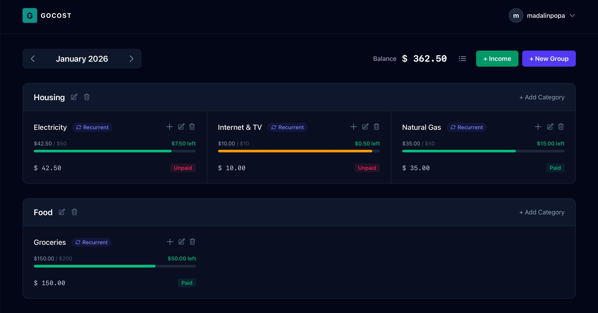

# gocost-web

Golang-based web application for personal expense management, focused on a clean monthly workflow and intuitive tracking of recurring and non-recurring costs.

## Screenshots



## Overview

### Typical Workflow
- **Pick a month**: move between months to review past spending or plan upcoming costs.
- **Set up categories**: create monthly-only categories for one-offs and recurring categories for ongoing costs.
- **Record expenses**: add amounts to each category and mark them as paid or unpaid.
- **Review status**: visually scan paid vs. unpaid items and adjust categories as plans change.

### Core Features
- **Category Management**: Organize expenses into groups (e.g., Housing, Transportation).
- **Flexible Category Types**:
    - **This month only**: applies only to the currently selected month.
    - **Recurrent**: persists across months until a specified end date (or indefinitely).

## Recording Expenses

For each expense category, the user can record expenses by providing:

- an **amount**, and
- a **payment status** (paid or unpaid).

The payment status is visually reflected in the category so the user can immediately see which expenses are settled and which are pending.

## User Experience Goals

- Intuitive navigation centered on monthly context.
- Clear grouping of categories and expenses.
- Efficient handling of both recurring and non-recurring costs.

## Technical Details

- **Backend:** Go (1.25+), `net/http`, `a-h/templ` for server-side UI rendering.
- **Frontend:** Tailwind CSS, HTMX for server-driven updates, Alpine.js for lightweight client state.
- **Data:** SQLite database with migrations managed by `goose`.
- **Configuration:** Environment-driven configuration via `.envrc` (generated from `envrc.template`).
- **Tooling:** `make` targets for build/dev/test; `air` for live reload.

## Environment Variables

Required:
- `ALLOWED_HOSTS`: comma-separated list of allowed hostnames (e.g. `localhost,example.com`).
- `DOMAIN`: base domain for the app (e.g. `localhost` or `gocost.example`).

Optional:
- `CURRENCY`: symbol shown in the UI (default: `$`).
- `DB_PATH`: SQLite file path used by the Docker entrypoint (default: `/app/data/data.sqlite`).
- `IMAGE_TAG`: Docker image tag used by `compose.yml` (default: `latest`).
- `GOOSE_DRIVER`, `GOOSE_DBSTRING`, `GOOSE_MIGRATION_DIR`: used by `goose` during development (see `envrc.template`).

### Project Structure

- `cmd/web`: web server entry point.
- `internal/domain`: core business entities.
- `internal/usecase`: application use cases and interfaces.
- `internal/interfaces`: HTTP handlers, routing, and web adapters.
- `internal/infrastructure`: configuration and storage implementations.
- `ui`: Templ components and static assets.
- `migrations`: SQL migration files.

## Run Locally with Docker

Use the provided `Dockerfile` and `compose.yml` to build and run the app locally.

```bash
# build the image for local use
docker build -t coderustle/gocost:local .

# create the external network used by compose (safe if it already exists)
docker network create public

# start the app on http://localhost:4000
IMAGE_TAG=local docker compose up
```

Optional environment overrides (set before `docker compose up`):
`ALLOWED_HOSTS`, `DOMAIN`, `CURRENCY`.

## Development

### Prerequisites

- Go 1.25+
- Node.js + npm (Tailwind CLI)
- Optional: `direnv` and 1Password CLI (`op`) for `.envrc` generation

### Common Commands

- `make init`: download deps, generate Templ, install npm packages, create `.envrc`.
- `make dev`: run server + Templ + Tailwind watchers with live reload.
- `make build/web`: build the web server binary to `bin/server`.
- `make test`: run Go tests under `./internal...`.
- `make test/race`: run race detector tests.
- `make check`: run `go vet` and `staticcheck`.

## Contributing

Contributions are welcome. Please follow these steps:

1. Fork the repository and create a feature branch.
2. Keep changes focused and follow the existing project layout.
3. Run `make test` (and `make check` if you have `staticcheck`) before opening a PR.
4. If you change `.templ` files or CSS, ensure generated files are up to date.
5. Open a pull request with a clear description of the change.
